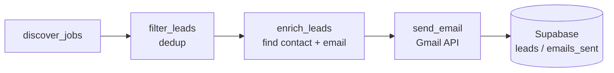
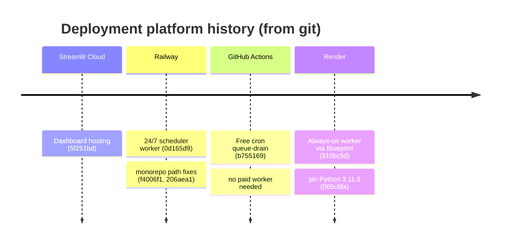
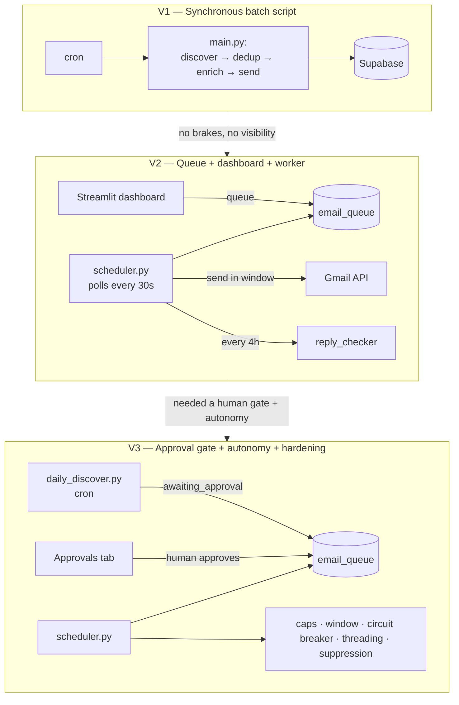

# Development Journey

> An honest engineering retrospective of **HireGen** — an automated recruiting-outreach agent that discovers companies hiring for engineering roles, finds a real contact at each, and sends personalized cold emails with follow-ups, all behind a human approval gate.
>
> This document is written for engineers, not recruiters. It favors what *broke* over what shipped. Every problem below is reconstructed from the actual source code and the ~60-commit git history — nothing here is invented, and where we lack real numbers we say so plainly.

---

## Table of Contents

1. [Why We Built This](#why-we-built-this)
2. [Initial Architecture](#initial-architecture)
3. [Problems We Faced During Development](#problems-we-faced-during-development)
4. [Architecture Evolution](#architecture-evolution)
5. [Performance & Deliverability Work](#performance--deliverability-work)
6. [AI Challenges (and the honest truth about "AI")](#ai-challenges-and-the-honest-truth-about-ai)
7. [Biggest Engineering Decisions](#biggest-engineering-decisions)
8. [What We'd Build Differently Today](#what-wed-build-differently-today)
9. [Future Improvements](#future-improvements)
10. [Lessons Learned](#lessons-learned)
11. [Repository Structure](#repository-structure)
12. [Acknowledgements](#acknowledgements)

---

## Why We Built This

The problem was mundane and specific: a small recruiting operation needed to reach hiring managers at companies that were **actively hiring engineers**, and doing it by hand did not scale.

The manual loop looked like this:

1. Search job boards for companies hiring for a role (e.g. "Backend Developer").
2. For each company, find a plausible decision-maker — a Head of Talent, a recruiter, a CTO at a small startup.
3. Find that person's work email.
4. Write a short, non-generic intro.
5. Send it, remember to follow up in a few days, and stop the moment someone replies or asks to be left alone.

Every step here has an off-the-shelf SaaS product (Apollo, Instantly, Lemlist, Clay, and so on). We did not use them for a few reasons that mattered at our scale:

- **Cost at low volume.** Most sequencing tools price for teams sending thousands of emails. We wanted ~10–20 *carefully chosen* sends per day, not a firehose.
- **We already had the data primitives.** Job discovery (SerpAPI), contact reveal (Wiza), and sending (a Google Workspace inbox) were all APIs we could call directly. The "product" was mostly glue.
- **Human-in-the-loop was a hard requirement.** We did not want a tool that sent autonomously. We wanted a queue a human approves before anything leaves the outbox. Most sequencing tools optimize for the opposite.

So the decision was: build a thin orchestration layer over APIs we already trusted, put a **Streamlit dashboard** in front of it for review, and keep a person in the approval path. The goal was never "a scalable SaaS." It was "one operator, one inbox, defensible sending behavior, full visibility."

That framing explains almost every trade-off in the rest of this document.

---

## Initial Architecture

The first working version was a **single synchronous Python script** — `main.py` — run on a schedule. It did the whole pipeline in one pass and sent emails directly:



There was no queue, no dashboard, and no approval gate. Discovery, enrichment, and sending happened inline, and the run was triggered by cron. It worked, but it was a batch job with no brakes — which set up most of the problems in the next section.

The components, and *why* each was chosen:

| Concern | Choice | Why |
|---|---|---|
| **Language** | Python 3.11 | Every API we needed had a first-class Python client, and the enrichment logic is I/O-bound glue, not CPU work. |
| **Job discovery** | SerpAPI Google Jobs, with **LinkedIn guest scrape + The Muse + Adzuna** as free fallbacks | SerpAPI is reliable but metered. When its quota runs out we fall back to sources that are free (or keyless). |
| **Contact discovery** | SerpAPI Google engine → Google CSE → Wiza reveal | Find a LinkedIn `/in/` profile by search, then pay Wiza only to reveal the work email for a *specific* profile. |
| **Database** | Supabase (hosted Postgres) | We needed a hosted SQL database with a service-role key usable from a background worker and from Streamlit, with zero ops. |
| **Email send + read** | Gmail API (OAuth) on a Google Workspace inbox | Sending from a real, authenticated mailbox (not an SMTP relay) is the single biggest deliverability lever for cold outreach. The same OAuth token also reads the inbox to detect replies. |
| **UI** | Streamlit (`dashboard/app.py`) | One file, no frontend build, no separate API server. For a single-operator internal tool this is the right amount of framework. |
| **Auth** | A static HMAC login gate | The dashboard is exposed publicly (Streamlit Cloud / Render), so it needed *a* lock — but not a full identity system for one user. |
| **Config** | `.env` locally, environment variables / Streamlit secrets in the cloud | Twelve-factor style; secrets never live in git. |

Nothing here is exotic. The interesting engineering was not in the choices — it was in everything that went wrong once these pieces met the real internet.

---

## Problems We Faced During Development

This is the important section. Each problem below is grounded in a specific commit or a specific piece of code still in the repository.

### 1. The LinkedIn search engine saga

**Problem.** The core of contact discovery is: given a company and a job title, find one LinkedIn `/in/` profile URL. We drove that through SerpAPI, and the choice of *search engine* and *query syntax* turned out to be a multi-day back-and-forth.

**Investigation.** The git history reads like a lab notebook:

- `337b016 Switch LinkedIn search to Bing engine (indexes LinkedIn far better than Google)`
- `f9abaac Expand SerpAPI diagnostic to test both Bing and Google engines, show top 3 URLs each`
- `8ad55b6 Use only Google engine for LinkedIn search — Bing ignores quoted phrases entirely`
- `72ed6a9 Fix LinkedIn search: drop site: operator, use keyword form instead`
- `6162c4f Try site:linkedin.com query first (Google supports domain-level site:), keyword form as fallback`
- `fb69056 Scope LinkedIn search to /in/ profiles via path-level site: operator`

We started on Bing because it *appears* to index LinkedIn more aggressively. But Bing (through SerpAPI) **ignored quoted exact-match phrases**, which made `"Head of Talent" "Acme Corp"` useless — it returned loosely related noise. Google honored the quotes and the `site:linkedin.com/in` path-level operator.

**Solution.** The code that survived (`agent/contact_finder.py`) settled on Google only, with two query styles tried in order, then a Google CSE fallback:

```python
def find_linkedin_url(company_name, title, log=print):
    queries = [
        f'site:linkedin.com/in "{title}" "{company_name}"',   # path-level x-ray: profiles only
        f'site:linkedin.com/in {title} {company_name}',       # looser: drop exact-phrase quotes
    ]
    for query in queries:
        url = _find_linkedin_via_serpapi(query, log=log)
        if url:
            return url
    # Final fallback: Google CSE
    return _find_linkedin_via_google_cse(f'"{title}" "{company_name}" linkedin.com/in', log=log)
```

**Lesson learned.** Search APIs are not interchangeable, and the syntax that works on one engine can be silently ignored by another. If we rebuilt this, we would treat "which engine + which query syntax" as an explicit, testable configuration from day one — with a small fixture of known company/title pairs to regression-test against, instead of discovering each quirk in production.

### 2. Contact matched to the wrong company

**Problem.** Even when a search returned a real LinkedIn profile, that person often only *mentioned* the target company (former employer, a post, a mutual connection). Wiza would then reveal an email at a completely different domain — the internal note in the code calls out the exact failure: a Visa job producing a contact at `imc.com`.

**Investigation.** The symptom was contacts whose email domain had nothing to do with the company we were targeting. Because Wiza charges per reveal, this was also burning credits on garbage.

**Solution.** `8e40d85 Verify contact email domain matches the target company`. We added `email_matches_company()`, which tokenizes the company name (dropping stopwords like `inc`, `llc`, `technologies`, `global`) and checks whether any meaningful token appears in the email domain:

```python
def email_matches_company(email, company):
    domain = email.split("@")[-1].lower()
    dom_flat = domain.replace(".", "").replace("-", "")
    tokens = _company_tokens(company)          # meaningful words only
    if any(t in dom_flat for t in tokens):
        return True
    ...
```

If the domain doesn't plausibly belong to the company, the contact is rejected and the loop tries the next title in `TITLE_PRIORITY`.

**Lesson learned.** When you chain a fuzzy step (search) into an expensive step (paid reveal), you need a cheap validation gate *between* them. Our gate is heuristic and imperfect — a company using a vanity or holding-company domain will be wrongly rejected — but it stopped the most embarrassing mismatches and saved reveal credits.

### 3. SerpAPI quota exhaustion — and a stale global flag

**Problem.** SerpAPI is metered. When the monthly quota runs out, every job-discovery and contact-search call starts failing, and the whole pipeline goes quiet.

**Investigation & solution.** This produced two layers of work:

- **Fallbacks.** `b4a747b` added Hunter.io as a direct email fallback; `db0e150` added Google Custom Search (100 free queries/day) as a LinkedIn-URL fallback, forming the chain **SerpAPI → Google CSE → Wiza**. Job discovery gained its own parallel fallbacks: **LinkedIn guest scrape → The Muse → Adzuna**.
- **A self-inflicted bug.** To avoid hammering an exhausted quota, `job_discovery.py` sets a module-level `_serpapi_quota_exhausted = True` on the first 429. But an early version made that flag *persist too aggressively*, so SerpAPI was never retried even after the quota refilled. `659fb75 Fix: remove persistent exhausted flag so SerpAPI retries after quota refill` reset it to per-process scope.

```python
_serpapi_quota_exhausted = False  # module-level flag; reset on each process start

def _search_serpapi(role, location=None, num=10):
    global _serpapi_quota_exhausted
    if _serpapi_quota_exhausted:
        return []
    ...
    if resp.status_code == 429:
        _serpapi_quota_exhausted = True   # stop hammering *this* process only
        return []
```

**Lesson learned.** Circuit breakers are correct, but *where you store the breaker's state* is a design decision, not an afterthought. A process-lifetime flag is fine for a short-lived cron job and wrong for a long-running worker. We chose per-process because our discovery runs are short-lived; a long-running service would need a TTL.

### 4. The Google CSE "enabled but still 403" trap

**Problem.** The Google CSE fallback returned `403 PERMISSION_DENIED: This project does not have the access to Custom Search JSON API` even after the Custom Search API showed as **Enabled** in the Google Cloud console.

**Investigation.** Enabling the API in one project does not help if the **API key belongs to a different project**. The error message ("this project") refers to the key's project, not the one you were looking at. A second variant — `Requests to this API ... are blocked` — appears when an API-key restriction excludes Custom Search.

**Solution.** The fix is operational, not code: create the API key **inside the same project** where Custom Search is enabled, and remove key restrictions (or explicitly allow the Custom Search API). The code already degrades gracefully — if CSE isn't configured or returns non-200, `_find_linkedin_via_google_cse` logs and returns `None`, and the company is simply skipped.

**Lesson learned.** For third-party APIs, "enabled" is a three-part claim: the API is on, *in the key's project*, *and the key is allowed to call it*. Any diagnostic that only checks one of the three will mislead you. Our lookup diagnostics panel (see #10) now surfaces the raw error text so this is debuggable from the UI instead of the server logs.

### 5. Streamlit secrets, env vars, and the red banner

**Problem.** Configuration is read in three different environments — local `.env`, Streamlit Cloud secrets, and plain env vars on Railway/Render. Getting the precedence wrong caused two distinct failures: API keys reading as empty in the cloud, and a scary red **"No secrets files found"** banner rendered across the app.

**Investigation.** Two commits tell the story: `89f3b0a Fix _get_secret: check os.getenv first so Streamlit Cloud secrets work reliably` and `fb0700e Read env vars before st.secrets to stop 'No secrets files found' banner`. The banner appears simply because *accessing* `st.secrets` when no `secrets.toml` exists triggers Streamlit's error UI — even inside a `try/except`.

**Solution.** Every module now uses the same `_get_secret()` pattern: **env var first**, and only touch `st.secrets` if a `secrets.toml` actually exists on disk:

```python
def _get_secret(key, default=""):
    val = os.getenv(key, "")
    if val:
        return val
    paths = [os.path.expanduser("~/.streamlit/secrets.toml"),
             os.path.join(_BASE_DIR, ".streamlit", "secrets.toml")]
    if any(os.path.exists(p) for p in paths):   # probe file BEFORE touching st.secrets
        try:
            import streamlit as st
            return st.secrets.get(key, default) or default
        except Exception:
            pass
    return default
```

A related ordering bug: `d728ccc Call st.set_page_config before any st.secrets access` — Streamlit requires `set_page_config()` to be the very first Streamlit call, and our secrets probing violated that.

**Lesson learned.** This exact `_get_secret` block is duplicated in three files (`contact_finder.py`, `job_discovery.py`, and inline in `app.py`). That duplication is a smell — a shared `config.py` would have prevented fixing the same bug in multiple places. We traded correctness-under-time-pressure for DRY, and it shows.

### 6. Gmail OAuth token: pickle to portable JSON

**Problem.** The Gmail OAuth token was originally persisted as a Python **pickle**. Pickles are version- and library-sensitive — a token pickled under one `google-auth` version could fail to load under another on the deploy host.

**Investigation & solution.** A run of commits migrated the token to portable JSON: `e13c0b9 Load Gmail/Sheets token as portable JSON instead of pickle`, `aa975cf generate_gmail_token.py: emit portable JSON token, not pickle`, `e7451a7 Add generate_gmail_token.py helper to produce GMAIL_TOKEN_B64`. The loader keeps a **backward-compatible pickle fallback** so old tokens still work:

```python
def _creds_from_bytes(data):
    try:
        info = json.loads(data.decode("utf-8"))            # portable path
        return Credentials.from_authorized_user_info(info, SCOPES)
    except Exception:
        return pickle.loads(data)                          # legacy pickle fallback
```

The token is shipped to cloud hosts as a base64 env var, `GMAIL_TOKEN_B64`, decoded at runtime.

**Honest wart.** The GitHub Actions workflow still references a secret named `GMAIL_TOKEN_PICKLE_B64` and decodes it into `gmail_token.json` — the *name* is a fossil from the pickle era even though the payload is now JSON. It works, but it's the kind of naming drift that confuses the next person.

**Lesson learned.** Never persist auth state in a format coupled to your library versions. JSON (or any documented, stable serialization) survives dependency upgrades; pickle does not.

### 7. OAuth scopes and graceful degradation

**Problem.** Reply detection needs to *read* the inbox, which requires the `gmail.readonly` scope. Tokens minted before that scope was added would 403 on every reply check.

**Solution.** `9c880c3 Add gmail.readonly scope for reply detection; fail gracefully without it`. The reply checker detects the specific `insufficientPermissions` error and stops early with a clear, actionable message instead of logging the same 403 for every lead:

```python
if "insufficientPermissions" in str(e) or "insufficient authentication scopes" in str(e):
    print("[Reply Checker] ⚠️ Gmail token is missing the read scope (gmail.readonly). "
          "Regenerate GMAIL_TOKEN_B64 with the updated scopes ...")
    return updated   # bail out of the whole batch, don't spam the same error
```

**Lesson learned.** When one missing permission will fail *every* item in a batch, detect it on the first failure and abort the batch with a fix-it message. Retrying the other N-1 items only produces N copies of the same error.

### 8. Login persistence: a cookie component that broke the wizard

**Problem.** The dashboard is a multi-step wizard, and Streamlit wipes `st.session_state` on every full page reload — so a refresh logged the user out mid-flow.

**Investigation.** The first fix (`27badb9 Persist login across page refresh via a signed cookie`) used a third-party cookie component. That component re-rendered and interfered with long-running operations (the 10–20 minute contact lookup), which is captured bluntly in `b162de9 Fix broken wizard: replace cookie component with URL-token login persistence`.

**Solution.** We replaced the cookie with a **signed token in the URL query string** — an HMAC of the credentials, so it can't be forged and reveals nothing about the password:

```python
def _auth_token():
    secret = _secret("APP_LOGIN_EMAIL", "...") + ":" + _secret("APP_LOGIN_PASSWORD", "...")
    return hmac.new(secret.encode(), b"hg-auth-v1", hashlib.sha256).hexdigest()
```

On load, if `?s=<token>` matches, the session is restored. No component, no re-render, nothing to interfere with a long operation.

**Lesson learned.** In Streamlit, any stateful browser component you add is also code that runs on every rerun. For something as load-bearing as auth, a stateless mechanism (a signed URL token) is more robust than a stateful widget.

### 9. Nested expanders and a dead tab

Two smaller but real UI failures worth recording honestly:

- `83fb727 Fix nested-expander crash in test-email error detail` — Streamlit **does not allow an expander inside an expander**, and doing so throws at render time. The fix was to flatten the error-detail UI.
- `6c8b72e Remove Layoffs tab (no backing module)` — a tab existed in the UI with no module behind it. It was removed rather than left as a broken affordance.

**Lesson learned.** UI frameworks have structural rules (no nested expanders) that only fail at runtime, not at import. And every visible affordance is a promise; a button with nothing behind it is worse than no button.

### 10. Debugging a pipeline you can't see

**Problem.** The contact-lookup pipeline runs server-side across many companies and can take 10–20 minutes. When it silently produced no contacts in the cloud, there was no way to tell *which* stage failed — search? reveal? a missing key?

**Investigation & solution.** A cluster of commits added **observability into the UI itself**: `899b584 Add debug logging`, `e844ec4 Show key status and errors visibly`, `df2b285 Add Step 4 contact-lookup diagnostics`, `5dd2d14 Add SerpAPI diagnostic test`, `fcec462 Add live lookup log`. The Step 4 diagnostics panel now shows masked API keys, live SerpAPI quota, a one-company live search test, and a per-company running log.

**A bug hiding in the debug tool.** The live log itself shipped with a defect: it wrote each line by calling `.markdown()` directly on a Streamlit expander, which *appends* a new element per call rather than replacing — so the log re-printed its entire tail on every update and looked like the same companies were being processed dozens of times (`ea7f469 ... fix log duplicates`). The fix is a single overwritten placeholder:

```python
log_placeholder = log_area.empty()          # one element we overwrite
def add_log(msg):
    log_lines.append(msg)
    log_placeholder.markdown("\n\n".join(log_lines[-30:]))   # replaces, not appends
```

Importantly, this was **purely cosmetic** — each company still got exactly one Wiza reveal (verifiable by the stable reveal IDs in the log). But a confusing debug view is its own bug, because it makes you distrust correct code.

**Lesson learned.** Build observability *into* the surface the operator already looks at, not just server logs they'll never see. And know your rendering model: in Streamlit, calling `.markdown()` on a container appends; overwriting needs an `st.empty()` placeholder.

### 11. Follow-ups that started brand-new email threads

**Problem.** Follow-up emails use `Re: <original subject>`, but they were arriving as **new conversations**, not threaded under the intro — for us *and* for the recipient's mail client.

**Investigation.** Gmail threads by the `References` / `In-Reply-To` headers, **not** by a matching `Re:` subject. The original `send_email` set none of those headers, and nothing captured the intro's Gmail `threadId` or its RFC `Message-ID`, so there was nothing to thread against.

**Solution.** `c6e7f92 Add email threading support`. Each send now generates its own RFC `Message-ID` on the sender domain and returns the Gmail `threadId`; the intro stores both (`gmail_thread_id`, `rfc_message_id` — added to `leads` and `emails_sent`), and follow-ups reply into the same conversation:

```python
message["Message-ID"] = make_msgid(domain="hiregen.co")
if in_reply_to:                       # the intro's Message-ID
    message["In-Reply-To"] = in_reply_to
    message["References"]  = in_reply_to
...
payload = {"raw": raw}
if thread_id:                         # Gmail's internal thread id
    payload["threadId"] = thread_id
```

**Honest limitation.** Threading only works for intros sent *after* this change — leads emailed earlier never captured a thread id, so their remaining follow-ups still start fresh threads. That's unavoidable for historical data.

**Lesson learned.** Email threading is a header protocol, not a subject-line convention. If you send transactional or sequenced mail, capture the `Message-ID` and `threadId` on the *first* message or you can never thread later ones.

### 12. Deliverability: the part that has nothing to do with code

**Problem.** Cold outreach from a young domain lands in spam. Ours did — even internal notification emails to ourselves were quarantined.

**Investigation.** Reading the raw headers showed the mail was DKIM-signed with Google's **default `*.gappssmtp.com` key**, not a custom DKIM record aligned to the sending domain, and DMARC was set to `p=quarantine`. Gmail's own "why is this in spam" reason was explicit: *previous messages from this domain were marked as spam* — a reputation problem, not an authentication one.

**Solution.** Two tracks, mostly outside the codebase:

- **Authentication (DNS):** set up a custom DKIM key in Google Workspace so mail is signed as the real domain, verified via a live test that scored 10/10 on mail-tester once the DKIM record propagated.
- **In-code deliverability behavior**, which *is* in the repo:
  - `ddac59d Personalize email templates: company-led subject + warmer copy + opt-out`
  - `64f186a Rotate intro subject/body variants per recipient` — batches of byte-identical mail are a bulk/spam signal, so each recipient gets a deterministic variant chosen by a hash of their email (so previews match sends):

    ```python
    seed = int(hashlib.md5((lead.get("contact_email") or "x").encode()).hexdigest(), 16)
    subject_tmpl = INTRO_SUBJECT_VARIANTS[seed % len(INTRO_SUBJECT_VARIANTS)]
    ```
  - Sends are spaced and capped (see [Performance & Deliverability](#performance--deliverability-work)).

**Lesson learned.** For cold email, *code is the small part*. Authentication (SPF/DKIM/DMARC alignment), domain age, and complaint rate dominate. mail-tester measures your setup; it cannot measure your reputation — that only recovers with slow, clean sending.

### 13. Deployment: a four-platform migration

**Problem.** "Where does the always-on sender run?" had four different answers over the project's life, each with a real constraint.



**Investigation & solution, per platform:**

- **Streamlit Cloud** hosts the dashboard well but cannot run a persistent background sender.
- **Railway** ran `scheduler.py` 24/7, but the monorepo layout (`outreach-agent/` inside a larger repo) broke the start command until the path was fixed (`f4006f1`, `206aea1`), and Streamlit warnings had to be suppressed in a non-Streamlit process (`206aea1`).
- **GitHub Actions** (`b755169`) is *free* and became the pragmatic scheduler: a weekday cron runs the pipeline once and exits. The trade-off is honest — cron granularity, cold starts, and no true always-on behavior.
- **Render** (`910bc5d`) runs `scheduler.py` as an always-on Blueprint worker (note: Render background workers require a **paid** plan). Deploying there surfaced a classic: `065c6fa Pin Python to 3.11.9 for Render (fix pandas source-build failure)` — newer Python had no prebuilt pandas wheel and tried to compile from source, which failed the build. `.python-version` and `render.yaml` both pin `3.11.9`.

**Lesson learned.** "Run a background job forever" has no free lunch. Free tiers sleep; always-on costs money; cron is free but coarse. We ended up supporting **both** a cron path (`main.py` / `scheduler.py --once` via GitHub Actions) and an always-on path (`scheduler.py` on Render) — flexibility we paid for in duplicated execution logic (see the architecture section).

---

## Architecture Evolution

The system moved through three recognizable stages. The forces pushing each transition were the problems above.



**V1 → V2: from batch to queue.** The synchronous script had no brakes and no visibility. Introducing an `email_queue` table decoupled *deciding to send* (dashboard) from *actually sending* (`scheduler.py`). The worker polls every 30 seconds, sends only inside the allowed window, and checks for replies every four hours. This is where the send caps, the send window, and reply detection live.

**V2 → V3: from tool to (supervised) agent.** Three capabilities defined V3:

- **A human approval gate** (`3d7f076`): new mail enters as `status = 'awaiting_approval'` and does not send until a person approves it in the Approvals tab. A daily reminder email nudges the approver.
- **Autonomy with the gate intact** (`8095124`): `daily_discover.py` runs each morning, discovers → dedups → finds verified contacts → drafts intros → queues them **as `awaiting_approval`**. The loop is "act → observe → self-correct → *after my approval*."
- **Hardening**: unsubscribe suppression (`25cc5f7`), the bounce-spike circuit breaker (`8095124`), email threading (`c6e7f92`), and send spacing (`d46be06`).

**The honest architectural tension.** Two execution paths still coexist:

- `main.py` — the original synchronous discover→enrich→**send-directly** pipeline, which is what the GitHub Actions workflow runs.
- `scheduler.py` — the queue-draining worker (Render/Railway), plus `daily_discover.py` for queue-filling.

They overlap in responsibility, and the send/follow-up logic is implemented **twice** (once in `main.py`, once in `scheduler.py`). This is technical debt we chose knowingly to keep the free cron path alive alongside the always-on worker.

---

## Performance & Deliverability Work

We'll be blunt: **we did not capture formal before/after benchmarks.** There are no latency traces, no throughput graphs, no load tests in this repository. So this section documents the *deliberate* performance- and safety-related choices in the code, and is explicit about what is *not* optimized.

**What exists in the code:**

| Area | What we did | Where |
|---|---|---|
| **Discovery dedup** | Companies are de-duplicated into a `set` *during* discovery, so a company found by multiple role/location queries is only kept once. | `job_discovery.discover_jobs` (`seen_companies`) |
| **Fallback chains** | Both discovery and contact-finding fall back through multiple providers instead of failing on the first quota error. | `job_discovery`, `contact_finder` |
| **Send rate limiting** | Per-run cap (`PER_RUN_LIMIT`, default 5) and per-day cap (`DAILY_EMAIL_LIMIT`, default 20) so we never burst past Gmail's sending limits (`a77877e`). | `scheduler.process_queue` |
| **Send spacing** | 20–50s random gap between sends within a run so a batch doesn't leave in the same second (`d46be06`). | `scheduler.process_queue` |
| **Send window** | Sends only fire 8am–6pm Pacific on weekdays; scheduling snaps to the next valid slot so nothing shows a confusing pre-8am time (`a28f2fc`). | `_next_send_slot` |
| **Bounce circuit breaker** | If bounces in the last 24h exceed a threshold, sending auto-pauses to stop a reputation spiral (`8095124`). The code comment notes this would have caught an earlier real incident automatically. | `scheduler.sending_is_paused` |
| **DB indexes** | Indexes on the columns we actually filter by: `leads(status)`, `leads(next_followup_date)`, `emails_sent(lead_id)`, `email_queue(status)`, `email_queue(scheduled_for)`, `unsubscribes(email)`. | `supabase/*.sql` |
| **UI resource caching** | The Supabase client is created once via `@st.cache_resource`. | `dashboard/app.py` |
| **Deterministic variant selection** | Template variant is a pure function of the recipient's email hash, so the preview and the actual send always match — no wasted recomputation, no drift. | `email_sender.render_template` |

**What is deliberately *not* optimized, and we should say so:**

- **Contact lookup is fully sequential.** Each company is searched and revealed one at a time, and Wiza reveals are polled for up to 420 seconds each. A batch genuinely takes 10–20 minutes. There is no concurrency, no async, no worker pool. This is the single biggest performance weakness in the system.
- **No caching of search results.** The same company searched twice hits the API twice.
- **Sending caps are for deliverability, not throughput.** We intentionally send *slowly*; "performance" here means "does not get us blocked," not "maximizes messages per minute."

**Lesson learned.** Not measuring is itself a finding. We optimized for *safety* (caps, spacing, windows, circuit breaker) because the failure mode we feared was a burned domain, not slow throughput. But because we never instrumented the enrichment path, "10–20 minutes" is an observation, not a measurement — and we can't tell you where those minutes actually go.

---

## AI Challenges (and the honest truth about "AI")

This is the section where honesty matters most, because the project is easy to mis-sell.

**There is no LLM in this codebase.** No `openai`, `anthropic`, `langchain`, `transformers`, or any generative library appears in `requirements.txt` or anywhere in the source. We verified this directly. The "AI" in the workflow is:

1. **API-based data enrichment** — SerpAPI (search), Wiza (contact reveal), Google CSE, Hunter.io. These are data services, not models we prompt.
2. **Deterministic template interpolation** — the emails are Python string templates with placeholders (`{first_name}`, `{company}`, `{role}`) filled by `str.format`, plus a small set of hand-written variants rotated per recipient.

```python
EMAIL_TEMPLATES = {
    "intro": {"subject": "{company} — a candidate for your {short_role} opening", "body": "Hi {first_name}, ..."},
    ...
}
# personalization = str.format(), not generation
subject, body = subject_tmpl.format(**context), body_tmpl.format(**context)
```

So the honest framing of "AI challenges" is **the challenges of building an autonomous agent *without* an LLM**, and why that turned out to be a reasonable choice for this problem:

| If we had used an LLM to write emails | What our template approach gave us instead |
|---|---|
| Per-send token cost | **Zero marginal generation cost** |
| Risk of hallucinated claims about the candidate or company | **No hallucinations** — every word is reviewed once, in the template |
| Nondeterministic output (preview ≠ send) | **Deterministic** — the hash-seeded variant means the preview is exactly what sends |
| Prompt injection surface (company names/titles flow into a prompt) | **No prompt to inject into** |
| Extra latency and an extra dependency to monitor | **One fewer moving part** |

What it *cost* us: the copy is rigid. Three intro variants and five follow-up templates do not adapt to the specific company, role nuance, or a prospect's public work. A genuinely personalized "I saw you're scaling your data platform" line is exactly where an LLM would earn its keep — and where our system is weakest.

**The most "AI-agent-like" behavior** in the system is not language generation at all — it's the **verification and fallback logic**: try engine A, then query style B, then provider C; reveal an email, then *validate* it against the company domain before trusting it; pause sending if bounces spike. That deterministic decision-making is what makes it feel like an agent, and it needed no model.

**Lesson learned.** "AI-powered" and "uses an LLM" are not the same claim. For a task that is mostly *retrieval, validation, and orchestration*, a deterministic pipeline can be more reliable, cheaper, and safer than a generative one. If we add an LLM later, the right place is the narrow, high-value slice — one personalized sentence per email, validated before it's queued — not the whole pipeline.

---

## Biggest Engineering Decisions

**Streamlit as the entire frontend.** For a single-operator internal tool, Streamlit removed an entire frontend build, API layer, and deployment target. The cost is real: `dashboard/app.py` is a single ~1,600-line file, Streamlit's rerun model fights long-running operations (the cookie/login saga, #8), and styling requires fragile CSS against internal `data-testid` selectors. For one user, still the right call. For a team, it would not be.

**Supabase over a self-hosted database.** A hosted Postgres with a service-role key usable from both a background worker and Streamlit, with zero ops, was worth more than any feature a fancier datastore offered. No regrets.

**Wiza for the paid step, search for the free step.** We deliberately kept the *expensive* operation (email reveal) behind *cheap* ones (search + domain validation), so we only pay to reveal a specific, already-validated profile. This is why the domain-match gate (#2) exists — it protects the paid step.

**Human-in-the-loop by default.** The approval gate (`awaiting_approval`) was a product requirement encoded as an architectural invariant: *nothing sends without a person clicking approve.* Even the autonomous `daily_discover.py` queues to that same gate. This constrained the design (a queue, a status machine, an Approvals UI) but it's the feature we'd defend hardest.

**Multiple execution paths for cost flexibility.** Supporting both a free GitHub Actions cron and a paid always-on worker was a conscious trade of code duplication for deployment optionality. Honestly, a single always-on worker with an internal scheduler would have been cleaner; we kept the cron path because "free" mattered.

---

## What We'd Build Differently Today

Rebuilding from scratch, with the benefit of every scar above:

1. **One execution path, not two.** Collapse `main.py` and `scheduler.py` into a single service with an internal scheduler (or a single `run_once` invoked by cron). The duplicated send/follow-up logic is the biggest source of "fix it in two places" risk.
2. **A real config module.** The `_get_secret` block is copy-pasted across three files. One `config.py` owning env/secrets precedence would have made the "red banner" and "keys empty in cloud" fixes one-line changes instead of three.
3. **Schema as code, enforced.** The SQL files in `supabase/` **drifted behind the application**: the code reads and writes columns (`response_status`, `response_snippet`, `campaign_id`, `campaign_name`, statuses like `awaiting_approval`/`cancelled`) that the checked-in `CREATE TABLE` statements don't fully declare — those columns were added directly in Supabase. A migration tool (or at least a single authoritative, versioned schema) would keep the repo honest about its own data model.
4. **Concurrent enrichment.** The sequential contact lookup is the clearest performance win available. Even a small bounded pool of concurrent searches + reveals would cut the 10–20 minute batch dramatically.
5. **Actual tests around the fragile logic.** There are **no automated tests** in the repository. The two areas that changed most under pressure — search query construction and the `_get_secret` precedence — are pure functions that would have been trivial and high-value to unit test.
6. **Structured logging instead of `print`.** Everything logs via `print()`. A structured logger with levels would make the cloud-debugging saga (#10) unnecessary.

---

## Future Improvements

A realistic roadmap — only things the current code makes natural next steps, not aspirational features:

- **De-duplicate the execution paths** (`main.py` vs `scheduler.py`) into one.
- **Parallelize contact enrichment** with a bounded concurrency limit and per-provider rate limits.
- **Version the database schema** with a migration tool so `supabase/*.sql` is the source of truth again.
- **One LLM-generated, validated sentence per email** — the narrow, high-value slice — gated behind the existing approval step.
- **A proper bounce/complaint feed** into the circuit breaker instead of counting `mailer-daemon` messages by keyword.
- **Reply classification beyond keyword matching** — the current `classify_reply` is a keyword list; even a small model would be more robust.
- **Separate the transactional sender from the outreach sender** so approval-reminder emails to the operator don't share reputation with cold outreach.
- **A minimal test suite** around query building, `_get_secret`, `email_matches_company`, and `_next_send_slot`.
- **Structured logging + basic metrics** (sends, bounces, reply rate) surfaced in the existing Analytics tab.

---

## Lessons Learned

Engineering takeaways, in order of how much they cost us:

1. **Third-party APIs are the product's real surface area.** Search-engine quirks (Bing ignoring quoted phrases), quota exhaustion, and the "enabled in the wrong project" 403 consumed more engineering time than any of our own logic. Build diagnostics for external dependencies *first*.
2. **Put a cheap validation gate between a fuzzy step and an expensive one.** Search → domain-match → paid reveal saved credits and stopped embarrassing mismatches.
3. **Know your framework's execution model.** Streamlit reruns everything; that single fact explains the login-cookie failure, the append-not-replace log bug, the nested-expander crash, and the hidden-header-broke-the-sidebar bug.
4. **Serialize auth state in a version-stable format.** Pickle coupled our tokens to library versions; JSON freed them.
5. **Email threading and deliverability are protocols, not conventions.** `References`/`In-Reply-To` headers thread mail; DKIM alignment and reputation decide the spam folder. `Re:` and good intentions do nothing.
6. **Circuit-breaker state has a lifetime.** A process-lifetime flag is right for cron and wrong for a long-running worker.
7. **Not measuring is a decision with consequences.** We optimized for send *safety* and never instrumented the slow enrichment path, so we still can't say where the minutes go.
8. **"AI-powered" ≠ "uses an LLM."** For retrieval-and-orchestration problems, a deterministic pipeline can be the more reliable, cheaper, safer choice — and honesty about that is more useful to other engineers than hype.

---

## Repository Structure

```
outreach-agent/
├── agent/                    # Core pipeline modules (no UI)
│   ├── job_discovery.py      # SerpAPI Google Jobs + LinkedIn/Muse/Adzuna fallbacks
│   ├── contact_finder.py     # LinkedIn URL (SerpAPI→CSE) → Wiza reveal → domain verify
│   ├── dedup.py              # Existing-client (Google Sheet) + recently-contacted (Supabase) filters
│   ├── email_sender.py       # Gmail OAuth, templates + variants, threaded send
│   ├── reply_checker.py      # Inbox scan + keyword reply classification
│   └── suppression.py        # Permanent unsubscribe list (never-contact-again)
├── dashboard/
│   └── app.py                # Streamlit UI: wizard, Approvals, History, Queue, Sent, Analytics
├── supabase/                 # SQL for leads, emails_sent, email_queue, unsubscribes (+ threading migration)
├── main.py                   # V1 synchronous pipeline (run by GitHub Actions)
├── scheduler.py              # Queue-draining worker: send window, caps, replies, circuit breaker
├── daily_discover.py         # Autonomous morning loop → queues as 'awaiting_approval'
├── setup_gmail.py            # One-time Gmail OAuth consent
├── generate_gmail_token.py   # Emit portable JSON token → GMAIL_TOKEN_B64
├── render.yaml               # Render Blueprint (always-on worker)
├── railway.toml / Procfile   # Railway worker config
├── .github/workflows/        # daily_agent.yml — free weekday cron
├── requirements.txt          # Pinned deps (note: no AI/LLM libraries)
└── .python-version           # 3.11.9 (prebuilt-wheel compatibility)
```

Three things to understand about how the pieces relate:

- **`agent/` is UI-agnostic.** The dashboard, `main.py`, `scheduler.py`, and `daily_discover.py` are all *callers* of the same core modules.
- **The `email_queue` table is the seam** between deciding to send (dashboard / daily loop) and actually sending (`scheduler.py`).
- **`main.py` and `scheduler.py` overlap** — the acknowledged duplication described in [Architecture Evolution](#architecture-evolution).

---

## Acknowledgements

This project did not arrive fully formed. It was built the way most real software is: by shipping something that worked, watching it break against the actual internet, and fixing it one commit at a time. The git history — roughly sixty commits of "switch the engine," "fix the fallback," "handle the 403," "stop hammering the quota," "thread the follow-ups," "preserve the sidebar control" — *is* the design document.

Much of the hardest-won knowledge here came from **debugging in production**: reading raw email headers to understand a spam placement, watching a live per-company log to see which stage failed, and testing an API key directly to discover it belonged to the wrong project. The tooling grew alongside the failures, because you cannot fix what you cannot see.

If there is one thing we hope another engineer takes from this: **the interesting engineering was almost never in the happy path.** It was in the fallbacks, the validation gates, the graceful degradations, and the honest acknowledgment of what we chose *not* to build. We're publishing the scars on purpose.
