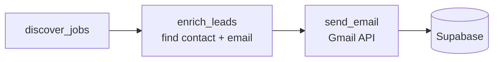
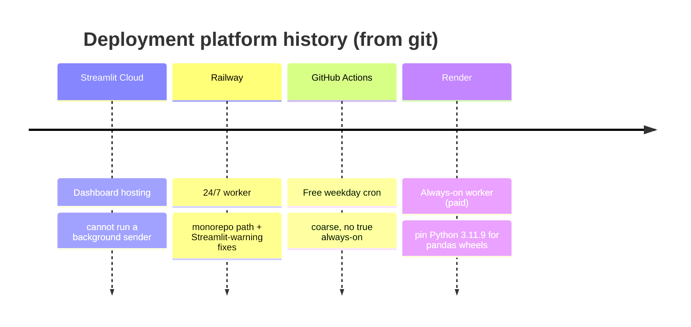
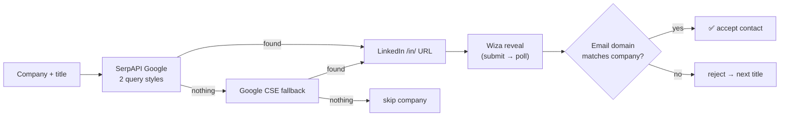

# 🛠️ The Engineering Journey Behind HireGen

A first-person case study of building an automated recruiting-outreach agent — including the parts that broke, the assumptions that were wrong, and how the architecture changed once I understood the real problem.

This is not a README. It's the story of how a naive **Discover → Find Contact → Send** script turned into a supervised outreach system with a human approval gate — and everything I learned in between. If you found this from my LinkedIn post: the honest version is that **there is no LLM in this project at all**, and the part I thought was the product — *sending the email* — was the easiest 20%.

---

## 📑 Table of Contents

1. [Why I Started This Project](#1--why-i-started-this-project)
2. [My Initial Assumption](#2--my-initial-assumption)
3. [The First Prototype](#3--the-first-prototype)
4. [What Went Wrong](#4--what-went-wrong)
5. [The Real Problem](#5--the-real-problem)
6. [Investigation](#6--investigation)
7. [Engineering Challenges](#7--engineering-challenges)
8. [The Architecture Evolution](#8--the-architecture-evolution)
9. [The Contact Discovery Pipeline](#9--the-contact-discovery-pipeline)
10. [The Deliverability Problem](#10--the-deliverability-problem)
11. [Lessons Learned](#11--lessons-learned)
12. [Technical Stack](#12--technical-stack)
13. [Future Roadmap](#13--future-roadmap)
14. [Final Thoughts](#14--final-thoughts)
15. [Contributing](#15--contributing)

---

## 1. 🎯 Why I Started This Project

Recruiting outreach is a grind, and most of it is mechanical. To place a candidate, someone has to find companies that are *actively hiring* for a role, find a real decision-maker at each one, get their work email, write something that isn't obviously a blast, send it, follow up a few times, and stop the second anyone replies or asks to be left alone.

Recruiters do all of this by hand — scrolling job boards, guessing at emails, keeping a spreadsheet of who they've already contacted. I wanted to compress that into a pipeline for one operator and one inbox:

> Continuously find companies hiring engineers, find the right person at each, and send a personalized intro with follow-ups — with a human approving everything before it leaves the outbox.

I deliberately did **not** want a mass-emailing machine. I wanted ~10–20 *carefully chosen* sends a day, full visibility, and a person in the approval path. What I didn't appreciate at the start was that "send a personalized intro" — the part that sounds like the product — would turn out to be the trivial step.

---

## 2. 💡 My Initial Assumption

My first mental model was almost embarrassingly straightforward:

- Search a jobs API → get companies hiring.
- Search for a contact → get a LinkedIn profile → reveal their email.
- Fill in an email template → call the Gmail API → done.

Every one of those is "just an API call." The data exists. The endpoints exist. How hard could it be?

> [!NOTE]
> This felt logical, and that's exactly why it was dangerous. It was a *reliability* assumption disguised as an *integration* task. I assumed that because each step had an API, each step would *work*. Wiring up the happy path took a weekend. Making it actually deliver correct contacts to real inboxes took months.

---

## 3. 🧱 The First Prototype

The original architecture (`main.py`) was three boxes running synchronously on a cron:



Concretely:

1. **Discover** — hit SerpAPI Google Jobs for a few role/location combos, dedup companies.
2. **Enrich** — for each company, search LinkedIn for a recruiter/CTO, then reveal the work email via Wiza.
3. **Send** — fill a template, call the Gmail API, write a row to Supabase.

It worked on the first run. I got company names, I got emails, I saw sends land in my "Sent" folder. I felt done.

I was not done.

---

## 4. ⚠️ What Went Wrong

The moment I checked the *output* against reality instead of just watching it run, the illusion collapsed:

| What I observed | Reality |
|---|---|
| 🎯 Contacts at the wrong company | A "Visa" job produced a contact whose email was `@imc.com` |
| 🕳️ Many companies returned no contact | The LinkedIn search silently found nothing for a large share of companies |
| 🔎 Same search, wildly different results | Switching the *search engine* changed everything — one returned profiles, another returned noise |
| 📉 Sends "succeeded" but landed in spam | Even internal notification emails to myself were quarantined |
| 🧵 Follow-ups started brand-new threads | `Re:` in the subject did nothing; each follow-up was its own conversation |

> [!WARNING]
> None of this *crashed*. The database had rows. The Gmail API returned `200`. Every dashboard number looked fine. These are the worst kind of bugs — the pipeline was quietly producing wrong or undelivered output while reporting success. My "sent" count was real; whether those emails were *correct* or *delivered* was a completely separate question I wasn't measuring.

I assumed the extraction of contacts must be flaky, so — like everyone — I went looking in the wrong place first.

---

## 5. 🔑 The Real Problem

Here's the reframe that changed how I thought about the whole project:

> [!IMPORTANT]
> The sending was never the hard part. The system was really **two hard problems wearing a trench coat**: (1) finding a *correct* contact, and (2) getting the email *delivered and not marked spam*. The Gmail API call in the middle — the thing I thought was the product — was the easy 20%.

And the second, more uncomfortable realization:

> [!NOTE]
> **There is no LLM in this project.** No `openai`, no `anthropic`, nothing generative in `requirements.txt`. The "personalization" is `str.format()` over hand-written templates. I mention this because it's the honest version of the LinkedIn-friendly "AI outreach agent" framing — what makes it feel like an agent is the *retrieval, validation, and fallback logic*, not language generation.

Once I saw the project this way, it stopped being "an email sender" and became "a **data-discovery + deliverability** problem that happens to send an email at the end."

---

## 6. 🔬 Investigation

I stopped guessing and started measuring — first for contact discovery, then for deliverability.

### Contact discovery: provider by provider

I put every search source behind a common interface (`find_linkedin_url`) and compared them on identical company/title queries.

| Provider | What it actually does | Where it shines | Where it struggles |
|---|---|---|---|
| **SerpAPI (Bing engine)** | Google-style results via Bing | Indexes LinkedIn aggressively | ❌ **Ignores quoted exact-match phrases** — `"Head of Talent" "Acme"` returned loosely-related noise, making it useless for precise matching |
| **SerpAPI (Google engine)** | Google's index of public LinkedIn profiles | Honors quotes and `site:linkedin.com/in` path-level operator | Metered; monthly quota runs out |
| **Google CSE** | Custom Search JSON API | Free (100 queries/day); good fallback | Config trap: "enabled" in the wrong project still 403s |
| **Wiza** | Reveals the work email for a *specific* LinkedIn profile | Accurate, work-email-only | Paid per reveal; async (submit → poll up to ~7 min) |
| **Hunter.io** | Finds an email by company domain directly | Works with no LinkedIn profile at all | Free tier is tiny (25/month) |

The Bing → Google switch is a real, documented back-and-forth in my git log — I even added a diagnostic that tested *both* engines and showed the top 3 URLs each, before concluding `8ad55b6 Use only Google engine — Bing ignores quoted phrases entirely`.

### Deliverability: reading the headers

When sends started landing in spam, I stopped theorizing and read the raw email headers. Two things jumped out:

- The mail was DKIM-signed with Google's **default `*.gappssmtp.com` key**, not a custom DKIM record aligned to my sending domain — so the domain earned zero reputation credit.
- Gmail's own "why is this in spam?" reason was blunt: *previous messages from this domain were marked as spam.* A **reputation** problem, not an authentication bug.

> [!IMPORTANT]
> The bottleneck for contact discovery was **upstream of my code** (the search provider), and the bottleneck for deliverability was **outside my code entirely** (DNS + domain reputation). Both times, I'd been tuning the part I controlled while the real problem lived somewhere I wasn't looking.

---

## 7. 🧩 Engineering Challenges

Discovery and deliverability were the headlines. Underneath were a stack of unglamorous problems — each one is a real commit.

### 🎯 Contacts matched to the wrong company

The LinkedIn search often returned someone who only *mentioned* the target company (a former employer, a post), and Wiza would reveal an email at a completely different domain — burning a paid reveal on garbage.

**Fix** (`8e40d85`): a cheap validation gate *between* the fuzzy search and the expensive reveal. `email_matches_company()` tokenizes the company name (dropping stopwords like `inc`, `technologies`, `global`) and checks the email domain. If it doesn't plausibly match, reject and try the next title.

```python
if VERIFY_CONTACT_DOMAIN and not email_matches_company(email, company_name):
    # the search matched someone who only *mentions* this company — skip
    continue
```

### 🚦 SerpAPI quota — and a stale global flag

SerpAPI is metered, and when it runs out the whole pipeline goes quiet. I added fallback chains (**SerpAPI → Google CSE → Wiza** for contacts; **LinkedIn guest scrape → The Muse → Adzuna** for jobs). But I also shipped a self-inflicted bug: a module-level `_serpapi_quota_exhausted` flag that persisted too aggressively, so SerpAPI was never retried even after the quota refilled (`659fb75` fixed it to per-process scope).

> [!NOTE]
> Circuit breakers are correct — but *where you store the breaker's state* is a design decision. A process-lifetime flag is fine for a short cron job and wrong for a long-running worker.

### 🔐 The Google CSE "enabled but still 403" trap

The CSE fallback kept returning `403 PERMISSION_DENIED: this project does not have access to Custom Search`, **even though the API showed as Enabled**. The cause: the API *key* belonged to a *different project* than the one I'd enabled it in. "Enabled" is a three-part claim — the API is on, *in the key's project*, *and the key is allowed to call it*. My diagnostics only checked one of the three.

### 🗝️ Secrets, env vars, and a scary red banner

Config is read across three environments (local `.env`, Streamlit Cloud secrets, plain env vars on Railway/Render). Getting precedence wrong made keys read as empty in the cloud, and merely *touching* `st.secrets` when no `secrets.toml` exists renders Streamlit's red "No secrets files found" banner across the app — even inside a `try/except`. The fix everywhere: **env var first, and only probe `st.secrets` if a `secrets.toml` file actually exists on disk.**

> [!WARNING]
> That exact `_get_secret` block is now copy-pasted in three files. I fixed the same bug in multiple places because I traded DRY for speed. A shared `config.py` would have made it a one-line change.

### 🥒 Gmail token: pickle → portable JSON

The OAuth token was originally a Python **pickle**, which is coupled to library versions — a token pickled under one `google-auth` version failed to load under another on the deploy host. I migrated it to portable JSON (with a legacy-pickle fallback so old tokens still work). Honest wart: the GitHub Actions workflow still references a secret named `GMAIL_TOKEN_PICKLE_B64` even though the payload is now JSON — a fossil name that'll confuse the next person.

### 🍪 Login persistence: a cookie that broke the wizard

The dashboard is a multi-step wizard, and Streamlit wipes session state on refresh. My first fix used a third-party cookie component — which re-rendered and *interfered with the 10–20 minute contact lookup* (`b162de9 Fix broken wizard: replace cookie component with URL-token login persistence`). I replaced it with a stateless **signed token in the URL** (an HMAC of the credentials).

> [!TIP]
> In Streamlit, any stateful browser component you add is *also code that runs on every rerun*. For something load-bearing like auth, a stateless mechanism beats a stateful widget.

### 🧵 Follow-ups that started new threads

Follow-ups used `Re: <subject>` but arrived as new conversations. Gmail threads by the `References` / `In-Reply-To` headers, **not** by a matching subject — and I was capturing neither the intro's RFC `Message-ID` nor its Gmail `threadId`. The fix generates a `Message-ID` on send, stores it plus the `threadId`, and replies into the same conversation. (Honest limit: only works for intros sent *after* the fix — historical leads never captured a thread id.)

### 📨 Bounces that were never detected

I recently found that bounce status *never* updated — because the reply checker searched `from:{contact_email}`, but a bounce comes from **`mailer-daemon`**, not from the contact. The `"bounced"` classifier was dead code. I added a dedicated NDR sweep that extracts the failed recipient and marks the lead — but **only for permanent failures**, because I also learned to distinguish a hard bounce (`Failure`, `5xx`, "address not found") from a transient `Delay` ("Gmail will retry for 46 more hours"), which should *not* kill a lead.

### 🐛 A bug hiding inside a debug tool

The live contact-lookup log shipped with a defect: it wrote each line by calling `.markdown()` on a Streamlit expander, which **appends** a new element per call instead of replacing — so the log re-printed its entire tail on every update and looked like the same companies were processed dozens of times. It was purely cosmetic (each company got exactly one reveal), but a confusing debug view is its own bug because it makes you distrust correct code. Fix: write into a single `st.empty()` placeholder.

### 🚢 Deployment: a four-platform migration

"Where does the always-on sender run?" had four answers over the project's life, each with a real constraint:



The Render move surfaced a classic: newer Python had no prebuilt pandas wheel and tried to compile from source, failing the build — `065c6fa Pin Python to 3.11.9`.

---

## 8. 🏗️ The Architecture Evolution

The three-box prototype grew into a real pipeline, one stage at a time — each stage added to fix a specific failure above.


| Version | The problem it solved |
|---|---|
| **V1 → V2** | The synchronous script had *no brakes and no visibility*. An `email_queue` table decoupled *deciding to send* (dashboard) from *actually sending* (`scheduler.py`), which is where send caps, the send window, and reply detection live. |
| **V2 → V3** | It needed a *human gate* and *autonomy*. New mail enters as `awaiting_approval` and won't send until a person approves it; `daily_discover.py` runs each morning and queues to that same gate. Hardening (suppression, bounce circuit breaker, threading) landed here. |

> [!WARNING]
> The honest architectural tension: `main.py` (synchronous, run by GitHub Actions) and `scheduler.py` (queue worker, run on Render) still overlap, and the send/follow-up logic is implemented **twice**. I kept the free cron path alive alongside the paid always-on worker, and paid for it in duplicated logic.

---

## 9. 🧭 The Contact Discovery Pipeline

Somewhere in this, the project's center of gravity moved. It stopped being "an email sender" and became a **contact discovery pipeline** — the send is just the last, easy step. The design principle: keep the *expensive* operation (Wiza reveal) behind *cheap* ones (search + domain validation), so I only pay to reveal a profile I've already validated.



The pieces:

- 🔌 **Pluggable search** — adding a provider means implementing one `search()`-style function.
- 🔎 **Two query styles then CSE** — `site:linkedin.com/in "title" "company"`, then a looser unquoted form, then Google CSE.
- 💳 **Paid reveal, gated** — Wiza reveals the work email only for a specific profile.
- 🛡️ **Domain validation** — the cheap gate that protects the paid step from wrong-company matches.
- 🔁 **Fallback chains everywhere** — both discovery and enrichment degrade through multiple providers instead of failing on the first quota error.

> [!WARNING]
> The pipeline's biggest weakness, stated honestly: **enrichment is fully sequential.** Each company is searched and revealed one at a time, and a Wiza reveal is polled for up to ~7 minutes. A batch genuinely takes 10–20 minutes. There is no concurrency — and because I never instrumented it, "10–20 minutes" is an observation, not a measurement.

---

## 10. 📬 The Deliverability Problem

This is the section that has almost nothing to do with code — and it's where I spent the time I *thought* I'd spend on the "AI."

### The bug: "sent" ≠ "delivered" ≠ "in the inbox"

My dashboard counted a Gmail `200` as success. But a `200` only means *Gmail accepted my API call* — not that the recipient's server accepted the mail, and definitely not that it landed in the inbox. Those are three different events, and I was only measuring the first.

### What actually determined the spam folder

> [!IMPORTANT]
> For cold email, **code is the small part.** The things that decided whether I hit the inbox were: DKIM/SPF/DMARC *alignment*, domain age, and complaint rate. I was signing with Google's default `gappssmtp.com` key (zero domain reputation credit) with DMARC at `p=quarantine`, on a domain that was only a few months old.

The fixes split cleanly into "outside the repo" and "inside the repo":

**Outside the repo (DNS/ops):** set up a custom DKIM key so mail is signed as the real domain. Verified with a live test that scored 10/10 on mail-tester once the record propagated.

**Inside the repo (behavior that protects reputation):**

| Lever | What it does | Commit |
|---|---|---|
| **Per-recipient template variants** | A batch of byte-identical mail is a bulk/spam signal; each recipient gets a variant chosen by a hash of their email (so the preview always matches the send) | `64f186a` |
| **Send caps** | Per-run (5) and per-day (20) caps so I never burst past Gmail's limits | `a77877e` |
| **Send spacing** | 20–50s random gap between sends within a run | `d46be06` |
| **Send window** | Only 8am–6pm Pacific on weekdays; scheduling snaps to the next valid slot | `a28f2fc` |
| **Bounce circuit breaker** | Auto-pause sending if bounces spike in 24h — stops a reputation spiral | `8095124` |
| **Threading** | Follow-ups reply into the intro's conversation via `Message-ID`/`References`/`threadId` | `c6e7f92` |
| **Suppression list** | An unsubscribe (or hard bounce) is honored permanently, across all future campaigns | `25cc5f7` |

### The honest bounce nuance

A recent, concrete example: an address (`rini@dotlab.asia`) produced two `Delivery Status Notification (Delay)` NDRs — *"Gmail will retry for 46 more hours."* That's a **soft** bounce, not a hard one. Marking the lead `bounced` there would be wrong; it might still deliver.

> [!NOTE]
> This is a real tradeoff, not a magic fix. I chose to flag **permanent** failures only (`Failure`, `5xx`, "address not found") and leave transient delays alone. The better long-term fix isn't looser rules — it's earlier visibility into addresses that are *struggling* before they hard-fail. I chose correct-but-cautious over aggressive-but-wrong.

---

## 11. 🎓 Lessons Learned

The lessons that actually changed how I build:

> [!TIP]
> **1. The APIs weren't the hard part — the reliability between them was.** Every integration "worked." Making them work *together, correctly, in the cloud* is where the months went.

> [!TIP]
> **2. Search quality decides everything downstream.** If the LinkedIn search never returns the right profile, no amount of validation or templating can recover it. My biggest wins were in the retrieval layer.

> [!TIP]
> **3. Put a cheap validation gate between a fuzzy step and an expensive one.** Search → domain-match → paid reveal saved credits and killed the wrong-company bug.

> [!TIP]
> **4. "Sent" is not "delivered."** A `200` from the send API is the *start* of delivery, not the end. Measure the inbox, the bounce, and the reply — not just the API response.

> [!TIP]
> **5. Deliverability is a protocol + reputation problem, not a code problem.** DKIM alignment and domain reputation decided the spam folder. `Re:` and good intentions did nothing.

> [!TIP]
> **6. Know your framework's execution model.** Streamlit reruns *everything* — that single fact explains the login-cookie failure, the append-not-replace log bug, and the nested-expander crash.

> [!WARNING]
> **7. Validate and serialize at the boundary.** Pickle coupled my auth tokens to library versions (JSON fixed it), and pinning + actually testing a Python version is not optional (pandas built from source and failed the deploy). Boundaries — DB, serialization, deploy runtime — are where "works on my machine" goes to die.

And the meta-lesson, the same one you'd take from any honest AI-adjacent project:

> [!IMPORTANT]
> **"AI-powered" ≠ "uses an LLM."** This system contains *no* generative model, and it's better for it: deterministic output, zero token cost, no hallucinated claims about a candidate, nothing to prompt-inject. What makes it feel like an agent is the orchestration — the fallbacks, the validation gates, the circuit breaker. If I add an LLM later, it belongs in one narrow slice (a single personalized sentence, validated before it's queued), not the whole pipeline.

---

## 12. 🧰 Technical Stack

| Technology | Role | Why I chose it |
|---|---|---|
| 🐍 **Python 3.11** | Core language | Best ecosystem for I/O-bound API glue; every service had a first-class client |
| 🎈 **Streamlit** | Dashboard & UI | Fastest path from script to a shareable, interactive tool — no frontend build, no separate API |
| 🐘 **Supabase (Postgres)** | Database | Managed Postgres + instant REST (PostgREST), usable from both a worker and Streamlit, zero ops |
| 📧 **Gmail API (OAuth)** | Send + read mail | Sending from a real authenticated mailbox is the single biggest deliverability lever; same token reads replies |
| 🟢 **SerpAPI** | Job + contact search | Reliable Google index for jobs and LinkedIn `/in/` profiles |
| 🔵 **Wiza** | Email reveal | Reveals the work email for a *specific* profile — the paid step, kept behind cheap validation |
| 🔎 **Google CSE / Hunter.io** | Search / email fallbacks | Free-tier safety nets when SerpAPI quota runs out |
| 📰 **LinkedIn guest / The Muse / Adzuna** | Job fallbacks | Keyless/free sources that keep discovery alive without SerpAPI |
| 📄 **Google Sheets (gspread)** | Existing-client list | Dedup against clients already being worked, using the same Gmail OAuth token |

> [!NOTE]
> The stack is deliberately modular: providers sit behind shared interfaces, sending is one step, storage is plain REST. Nothing here is exotic — the value is in how the pieces are arranged and *degraded*, not in any single tool. And notably: **no AI/LLM library appears anywhere in `requirements.txt`.**

---

## 13. 🗺️ Future Roadmap

Honest about what's next — and what's weak today.

- [ ] **Collapse the two execution paths** (`main.py` vs `scheduler.py`) into one — kill the duplicated send/follow-up logic.
- [ ] **Parallelize contact enrichment** — the sequential 10–20 minute lookup is the clearest performance win available.
- [ ] **Version the database schema** — the `supabase/*.sql` files have *drifted* behind the code (columns like `response_status`, `campaign_id`, and statuses like `awaiting_approval` exist in code but not in the checked-in SQL). A migration tool would make the repo honest about its own data model again.
- [ ] **Soft-bounce visibility** — surface addresses that are *struggling* (repeated `Delay` NDRs) before they hard-fail, and pause their follow-ups.
- [ ] **A real test suite** — there are currently **no tests**; the two areas that changed most under pressure (search query building, `_get_secret` precedence) are pure functions begging to be unit-tested.
- [ ] **Structured logging + metrics** — everything logs via `print()`; sends/bounces/reply-rate belong in the Analytics tab.
- [ ] **One LLM-generated, validated sentence per email** — the narrow, high-value slice, gated behind the existing approval step.
- [ ] **Separate transactional from outreach sending** — so approval-reminder emails don't share reputation with cold outreach.

---

## 14. 💭 Final Thoughts

When I started, I thought this was a *sending* project. I'd find an email, hit the Gmail API, and ship it.

What building HireGen actually taught me is that the send button was never the hard part — and there was no "AI" doing the heavy lifting, because there's no LLM here at all. The work that decided whether the product succeeded or failed was:

- **Contact discovery** — the search-provider quirks and the wrong-company matches that defined the enrichment step.
- **Deliverability** — DKIM, reputation, threading, caps, and the difference between "sent" and "in the inbox."
- **Orchestration** — the queue, the approval gate, the fallbacks, and the circuit breaker that make it behave like an agent.
- **The boring plumbing** — secrets precedence, token serialization, deploy runtimes, schema — where most of the real bugs lived.

The individual APIs are genuinely powerful. But a powerful API in a fragile system is still a fragile system. The engineering — the unglamorous, essential plumbing between the boxes — is what turns a weekend demo into something you'd actually let touch a real inbox.

If there's one line to take away: **the integration is the easy part; the reliability between integrations is the whole job.**

---

## 15. 🤝 Contributing

This is a real, imperfect, in-progress system — which makes it a good place to contribute. If any of the challenges above sparked ideas, I'd love the help.

Good places to jump in:

- 🐛 **Open an Issue** — wrong contacts, missed companies, deliverability edge cases, or ideas.
- 🔀 **Submit a Pull Request** — small and focused is welcome.
- 🔌 **Improve the search/enrichment providers** — raise contact-match accuracy, add a provider, or parallelize the lookup. Highest-leverage area.
- 📬 **Improve deliverability** — soft-bounce handling, reply classification beyond keywords, or reputation-safe sending logic.
- 🧱 **Reduce the tech debt** — a shared `config.py`, versioned schema migrations, or the first unit tests.

> [!NOTE]
> Contributions that improve *contact correctness* and *deliverability* are worth more here than any feature — because, as this whole journey argues, that's where the real problem lives.

---

*Built for one operator and one inbox, broken a few times, and rebuilt honestly. ⭐ If this engineering story was useful, star the repo and share it.*
